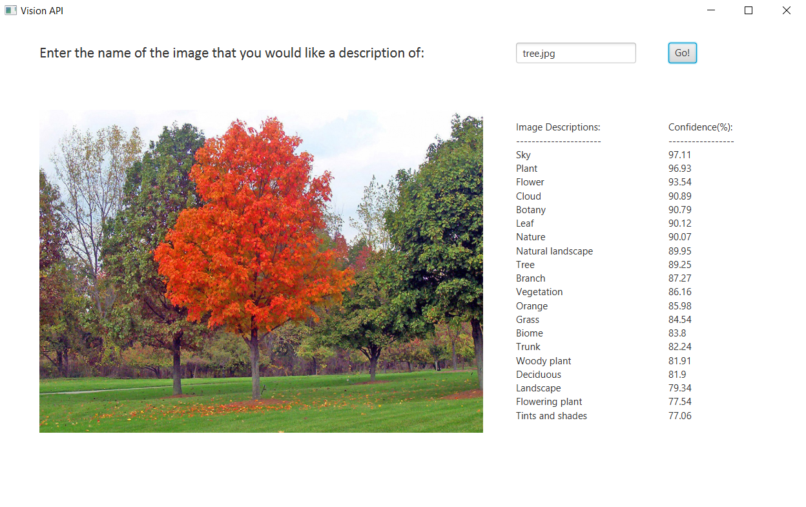

This program uses Google Cloud's [Vision API](https://cloud.google.com/vision) to get descriptions of images of your 
choice. Images can be added to the images folder to be used in the application.

The service of this application requires an authorization token in its header which expires every 30 minutes or so.
Follow the instructions on [Google's website](https://cloud.google.com/vision/docs/setup) to create a project, download
a JSON with an API key, and install Google's Cloud SDK. Use the correct command from the ones shown to provide 
authentication in your environment. Then run "gcloud auth application-default print-access-token" in the Cloud SDK
shell to receive an authorization token, and paste it after Authorization: Bearer in the @Header of the service.

Complaints about incorrect image labeling can be directed at Google. 

Enjoy!

